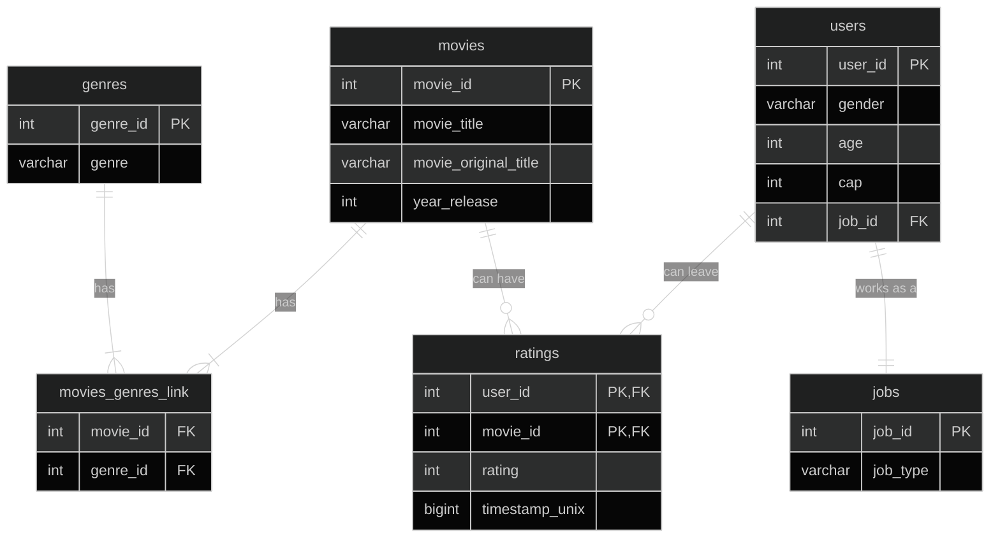

```mermaid
%%{
  init: {
    'theme': 'dark'
  }
}%%
erDiagram
  movies {
    int movie_id PK
    varchar movie_title
    varchar movie_original_title
    int year_release
  }
  genres {
    int genre_id PK
    varchar genre
  }
  movies_genres_link {
    int movie_id FK
    int genre_id FK
  }
  users {
    int user_id PK
    varchar gender
    int age
    int cap
    int job_id FK
  }
  jobs {
    int job_id PK
    varchar job_type
  }
  ratings {
    int user_id PK, FK
    int movie_id PK, FK
    int rating
    bigint timestamp_unix
  }
  movies ||--|{ movies_genres_link : has
  genres ||--|{ movies_genres_link : has
  users ||--o{ ratings : "can leave"
  movies ||--o{ ratings : "can have"
  users ||--|| jobs : "works as a"
```
